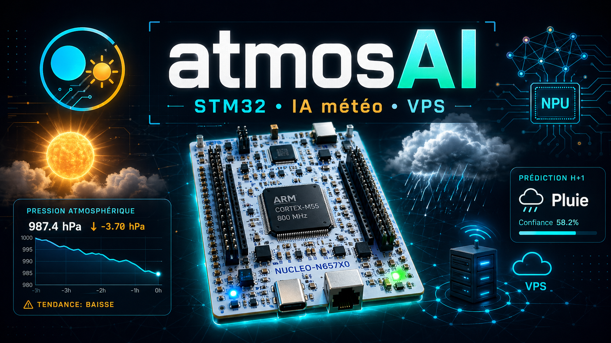

# AtmosAI — STM32 Weather Station with Edge AI and VPS Dashboard

> **Module ETRS606 — Embedded AI · Universite Savoie Mont Blanc**  
> William Z. · Franck G. · Mostapha K.

---

## Video

[](https://www.youtube.com/watch?v=44Mi2SmJl4s)

## What we built

AtmosAI is an end-to-end embedded weather station built around an **STM32 NUCLEO-N657X0** board and a self-hosted VPS dashboard.

The board reads local sensors, runs an embedded **H+1 weather classifier**, sends live telemetry to a Flask API over Ethernet, and also receives commands back from the server. The web dashboard displays live measurements, predictions, historical charts, board telemetry, IMU values, and a 3D board view driven by the accelerometer.

We did not use ThingSpeak or MATLAB. The full chain is ours: STM32 firmware, HTTP protocol, Flask API, SQLite storage, static dashboard, and admin page.

---

## Architecture at a glance

```text
+------------------------------------------------------+
|                 STM32 NUCLEO-N657X0                  |
|                                                      |
|  X-NUCLEO-IKS01A3 shield over I2C                    |
|  - HTS221  : temperature + humidity                  |
|  - LPS22HH : pressure                                |
|  - LSM6DSO : accelerometer + gyroscope               |
|                                                      |
|  Sensor thread (~5 s cycle)                          |
|      -> reads sensors                                |
|      -> updates telemetry                            |
|      -> pushes T/RH/P into H+1 ring buffer           |
|      -> runs h1_infer() locally on CPU               |
|      -> updates LEDs                                 |
|                                                      |
|  TCP thread                                          |
|      -> DNS resolve atmosai.willydev.xyz via 8.8.8.8 |
|      -> fallback to fixed VPS IP if DNS fails        |
|      -> HTTP POST /api/data                          |
|      -> HTTP GET  /api/command                       |
+-------------------------+----------------------------+
                          |
                          v
+------------------------------------------------------+
|                 VPS — Flask API + SQLite             |
|                                                      |
|  Stores measurements and telemetry                   |
|  Serves dashboard data                               |
|  Stores admin command for the board                  |
|  Runs optional longer-range forecast endpoints       |
+-------------------------+----------------------------+
                          |
                          v
+------------------------------------------------------+
|                  Web Dashboard                       |
|                                                      |
|  index.html  : main station dashboard                |
|  index2.html : detailed board telemetry + 3D view    |
|  admin.html  : admin commands and database tools     |
+------------------------------------------------------+
```

---

## Hardware

We use a **NUCLEO-N657X0** board based on the **STM32N657X0** Cortex-M55 MCU, with the **X-NUCLEO-IKS01A3** sensor shield.

Sensors used over I2C:

| Sensor | Role | Used for |
|---|---|---|
| **HTS221** | Temperature + humidity | Live weather values and H+1 model input |
| **LPS22HH** | Atmospheric pressure | Live pressure and pressure trend features |
| **LSM6DSO** | Accelerometer + gyroscope | IMU telemetry and dashboard 3D board motion |

The firmware runs on **Azure RTOS ThreadX**. The application is split into threads so the sensor cycle, network communication, and command handling stay separated.

---

## Embedded H+1 model

The embedded model predicts the weather class one hour ahead from local sensor data.

Architecture:

```text
Input: 13 features
      |
Dense 13 -> 32, ReLU
      |
Dense 32 -> 32, ReLU
      |
Dense 32 -> 16, ReLU
      |
Dense 16 -> 3, Softmax
      |
Clair · Pluie · Brouillard
```

Current model characteristics:

| Metric | Value |
|---|---|
| Accuracy | **87.5%** |
| Input features | **13** |
| Output classes | **Clair / Pluie / Brouillard** |
| Execution | **local STM32 CPU fallback** |
| Typical measured inference time | **~26 ms** |
| Typical CPU load | **< 1%** |

The model is executed locally on the STM32. The VPS is used for storage, visualization and supervision, not for the H+1 embedded inference.

### The 13 features

The model does not only use raw weather values. It also uses trend and time features computed from a RAM ring buffer.

| # | Feature | Source |
|---|---|---|
| 1-3 | temperature, humidity, pressure | Direct sensors |
| 4-5 | delta temperature 1h / 3h | Ring buffer |
| 6-7 | delta pressure 1h / 3h | Ring buffer |
| 8 | delta humidity 1h | Ring buffer |
| 9-10 | hour sin / hour cos | Time synchronized from VPS |
| 11-12 | month sin / month cos | Time synchronized from VPS |
| 13 | temperature - dew point | Embedded Magnus formula |

The trend features are important because a falling pressure or rising humidity is often more meaningful than an isolated value.

---

## NPU status

The project contains an integration attempt for the STM32N6 NPU runtime:

- NPU clock enabled during startup.
- ATON/STAI runtime initialized.
- STAI network initialization attempted.
- RISAF access configuration was investigated and tested.

However, `stai_network_run()` is not used in the final stable demo because the runtime consistently triggered an **Epoch Controller EC_IRQ = 0x8** bus error on this project setup. The stable final version keeps the NPU initialization path visible, then runs the same H+1 MLP on the CPU fallback to avoid crashing during the demonstration.

This is an intentional stability choice: the embedded prediction remains local, deterministic and demonstrable.

---

## Network communication

The STM32 communicates with the VPS using raw HTTP over TCP through NetXDuo.

### POST — board to VPS

Every completed sensor cycle, the board sends:

```http
POST /api/data HTTP/1.1
Host: atmosai.willydev.xyz
Content-Type: application/json
X-API-Key: atmosai_w1lly_2026
Connection: close
```

The JSON contains:

- temperature, humidity, pressure
- H+1 prediction and confidence
- IMU status, accelerometer and gyroscope values
- CPU load, inference time, estimated power, cycle period
- uptime and POST status counters

### GET — VPS to board

After the POST, the board performs:

```http
GET /api/command HTTP/1.1
Host: atmosai.willydev.xyz
X-API-Key: atmosai_w1lly_2026
Connection: close
```

This is used for the downlink part of the project. For example, the admin page can request the **dance mode**, and the board executes it on the next cycle.

### DNS with fallback

At startup, the TCP thread tries to resolve:

```text
atmosai.willydev.xyz
```

using Google DNS:

```text
8.8.8.8
```

If DNS fails, times out, or is blocked by the network, the firmware automatically falls back to the fixed VPS IP address. This keeps the demo robust on unknown networks.

---

## VPS backend

The VPS hosts the server side of the project:

- **Flask** API
- **SQLite** database
- static HTML/CSS/JS dashboard files
- admin endpoints protected by API key
- command storage for board downlink

The database stores not only weather values, but also board telemetry such as CPU load, inference time, cycle period, power estimate, IMU values and POST status. This avoids stale in-memory telemetry when the server is restarted or when multiple workers are used.

Main API behavior:

| Route | Role |
|---|---|
| `POST /api/data` | Receives STM32 measurements and telemetry |
| `GET /api/data` | Serves latest measurements to the dashboard |
| `GET /api/command` | Lets the board fetch the pending admin command |
| Admin routes | Database reset, purge and command control |

---

## Web dashboard

The dashboard is built in vanilla HTML/CSS/JS.

Current pages:

| File | Role |
|---|---|
| `index.html` | Main station dashboard |
| `index2.html` | Detailed board page with telemetry and 3D board view |
| `admin.html` | Admin page for commands and database control |

Main features:

- dark/light theme persisted across pages
- live temperature, humidity and pressure
- H+1 prediction with confidence
- historical charts with Chart.js
- pressure displayed on its own chart axis
- live CPU, inference time, cycle period and power estimate
- IMU values from the LSM6DSO
- pseudo-3D board view driven by accelerometer data
- command status and real-time connection state

The dashboard refreshes live data approximately every **5 seconds**, matching the current STM32 measurement cycle.

---

## Admin page and dance mode

The admin page can send commands from the VPS to the STM32.

The most visible command is **dance mode**:

- the admin page stores a pending `dance` command
- the board fetches it through `GET /api/command`
- the normal sensor/inference cycle pauses
- LEDs blink for about **20 seconds**
- the console prints a progress bar
- after the dance, the board resumes normal measurements and POSTs

This demonstrates bidirectional communication:

```text
STM32 -> VPS : POST measurements
VPS   -> STM32 : GET command response
```

---

## Embedded performance measurement

The firmware uses the Cortex-M55 **DWT cycle counter** to measure active CPU work and H+1 inference time.

Example console output:

```text
[PWR] Periode cycle : 5060 ms
[PWR] CPU load      : 0.9 %
[PWR] h1_infer()    : 26513.47 us  (15908083 cyc)
[PWR] I estimee     : 31.1 mA
[PWR] P estimee     : 103 mW  (0.103 W)
```

The goal is not only to predict weather, but also to show that the embedded workload is measurable and lightweight.

---

## Key numbers

| Metric | Value |
|---|---|
| Board | NUCLEO-N657X0 |
| Shield | X-NUCLEO-IKS01A3 |
| Weather sensors | HTS221 + LPS22HH |
| IMU sensor | LSM6DSO |
| H+1 embedded accuracy | **87.5%** |
| H+1 classes | Clair / Pluie / Brouillard |
| Features | **13** |
| Measurement cycle | **~5 s** |
| Dance mode duration | **~20 s** |
| Network protocol | HTTP over TCP |
| DNS | 8.8.8.8 with fixed-IP fallback |
| Database | SQLite |
| Dashboard refresh | **~5 s** |

---

## Running the project

### Firmware

Open the project in STM32CubeIDE, build and flash the FSBL project.

Important firmware constants are in:

```text
FSBL/NetXDuo/App/app_netxduo.c
```

This file contains:

- VPS fallback IP
- VPS port
- HTTP POST and GET formatting
- API key header
- DNS resolution logic
- sensor thread and TCP thread logic

### VPS backend

Run the Flask API on the VPS and expose the configured port. The STM32 currently targets the API through:

```text
http://atmosai.willydev.xyz:5080
```

The API key must match the value used by the firmware.

### Dashboard

Serve the static files from the VPS web directory:

```text
index.html
index2.html
admin.html
```

---

## Team

| | |
|---|---|
| **William Z.** | TRI |
| **Franck G.** | TRI |
| **Mostapha K.** | ESET |

---

*ETRS606 — Embedded AI · Universite Savoie Mont Blanc · 2026*
